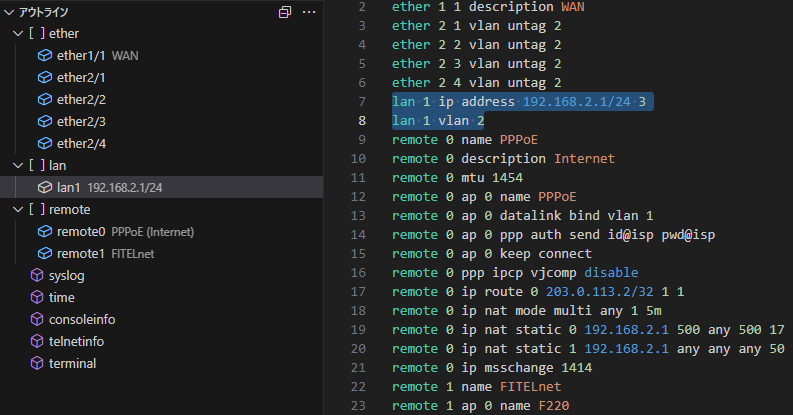

# Si-R Config for Visual Studio Code

Si-R/SR-Sシリーズのコンフィグファイル用VSCode拡張機能です。
ハイライトとアウトライン表示に対応しています。

**動作イメージ**

## 参考資料

- [Si-R Gシリーズ マニュアル](https://www.fujitsu.com/jp/products/network/router/manual/sir-g/)
- [SR-Sシリーズ マニュアル](https://www.fujitsu.com/jp/products/network/lan-switch/manual/sr-s/)

## リポジトリ

- [GitHub](https://github.com/caribouHY/vscode_si-r_config)